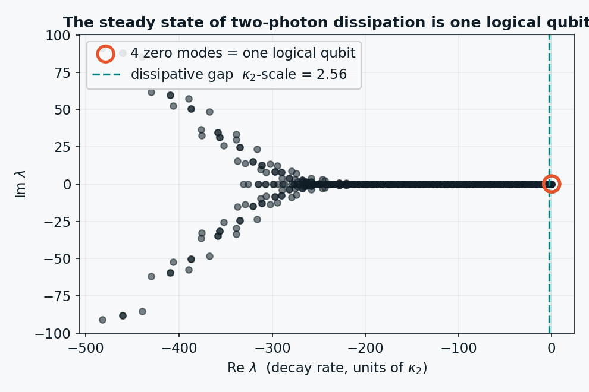
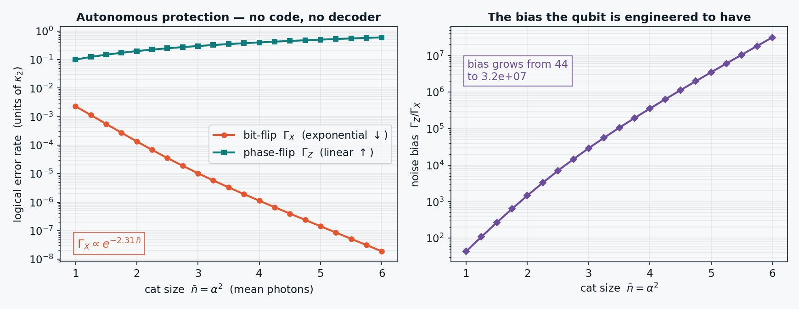

# The Descent to the Floor
### An AI-generated ladder of ideas for fault-tolerant quantum hardware — with a simulation at the bottom

*Dossier QC-Accelerate · strategy-room working draft · pre-release.*
*Every claim below wears an honest label. Draft numbers are welcome; an **unlabeled** estimate is the only violation.*

---

## What this document is

This is a record of a single working session in which an AI was pushed, repeatedly, to go *deeper* on one question: **can AI and robotics shorten the road to a fault-tolerant quantum computer — not by tuning what we already have, but by changing the physical thing a qubit is made of?**

Each push peeled back a layer. The session bottomed out at a genuine reconception of what a qubit *should be*, and then — because ideas are cheap and the dossier's currency is verifiable work — the AI ran a simulation at that floor and reported what came out, including the part of its own story it had to cut because the numbers refused to support it.

The document is written **floor-first**: the deepest idea, the one that reframes everything, comes first, with its simulation. Then we climb back up the ladder through the shallower, more deployable rungs. A spine runs through every rung, and the simulation lives at the bottom.

**The spine.** Every level is the same idea getting more fundamental: *hide the qubit where the noise cannot reach it.* And the **design object the AI searches gets deeper at each rung** — from device parameters, to materials, to error-correcting codes, to the open-system generator itself. The deeper the rung, the larger and less human-intuitable the search space, and the better-suited it is to machine search.

---

## THE FLOOR — Fault tolerance as a phase of matter

### The reframe

Every mainstream quantum computer is built on one paradigm: **isolate and correct.** Build a near-perfect closed system, watch it constantly, and fix errors in real time with a fast classical feedback loop. The million-qubit price tag of fault tolerance is the cost of that propping-up — the *overhead exponent* you pay to buy one good logical qubit out of a thousand fragile physical ones.

The floor is a different paradigm: **organize, and let the physics correct.** Build an *open* quantum system whose dynamics have a protected fixed point — a state the system's own time-evolution continuously returns to after a perturbation, because returning is what the dynamics *do*. The logical qubit stops being a fragile object you correct and becomes a **self-healing attractor**: error correction as a property of a steady state, not an algorithm you run. Protection becomes a *phase of matter*, not a piece of software.

### Why this is not fantasy: three independent roads, one destination

This session reached the floor from three unrelated directions that turn out to be the same idea:

- **Self-correcting topological matter.** An energy gap plus global topology passively pump the system back into the code space; local noise *cannot assemble* a logical error. The 4D toric code does this provably; whether a realizable **3D** version exists was a 20-year wall — and a May 2026 preprint claims to have cracked it (labeled below, with the authors' own caveats).
- **Biology — read honestly.** Where biology demonstrably sustains a functional quantum process in a warm, wet environment (the avian magnetic compass), it does so on the one degree of freedom the thermal bath barely touches: **spin**. The romantic "photosynthesis runs a quantum search" story did *not* survive scrutiny — the long-lived signals were vibrational, and electronic coherence dephases in tens of femtoseconds. Biology didn't break the rules; it found the same door we found. Its real, transferable lesson is the deeper one: robust function as an *attractor of an open system coupled to a structured environment* — homeostasis, not isolation.
- **Engineered dissipation / autonomous QEC.** You can deliberately tailor a system's coupling to an engineered reservoir so that its *steady state is the protected logical manifold*. This is demonstrated hardware, not theory: bosonic "cat" qubits stabilized by engineered two-photon dissipation, corrected with continuous-wave drives only — no syndrome measurement, no fast feedback.

Three roads, one destination: **the qubit as a self-healing attractor of engineered open-system dynamics.**

### The AI play at the floor

At the device level, AI tunes parameters. At the floor, the qubit is a *mathematical object* — an open-system generator, the **Lindbladian**: a Hamiltonian *plus* the engineered dissipators (jump operators) that define the system's relationship to its bath. "Is this a good qubit?" becomes a computable question: *does this Lindbladian have a steady-state manifold that encodes a logical qubit, attracts the dominant errors back to it, and (eventually) admits protected gates?* That space is vastly larger and far less intuitable than any closed-system code — humans are notoriously bad at reasoning about dissipative steady states — which makes it the single best target for machine search in the whole field. A published proof-of-concept already exists ("automated discovery of autonomous QEC schemes").

---

## The simulation at the floor

To make the floor concrete rather than rhetorical, we built — from scratch, in ~60 lines of NumPy, no quantum libraries — the smallest honest instance of an *engineered open quantum system that stores and protects a logical qubit with no error-correcting code and no decoder.*

**The system.** One bosonic mode (a truncated harmonic oscillator). One engineered dissipator: two-photon loss, `L₂ = √κ₂ (a² − α²)`. One unavoidable physical noise: single-photon loss, `L₁ = √κ₁ a`. We assemble the full Lindblad superoperator (the Liouvillian) as a matrix and read its spectrum. Decay rates are minus the real parts of its eigenvalues; a steady state is an eigenvalue at zero.

### Result 1 — the steady state *is* a logical qubit

With two-photon dissipation alone, the Liouvillian has **exactly four eigenvalues pinned at zero** — the 2×2 operator space of one logical qubit — cleanly separated from everything else by a dissipative gap of order κ₂. The protected degree of freedom is not designed in by hand; it is the kernel of the engineered dynamics. (By contrast, *single-photon* engineered dissipation `a − √α²` yields a one-dimensional steady manifold — a single state, which cannot hold a qubit. The *form* of the dissipator decides whether a logical qubit exists at all.)

### Result 2 — autonomous protection, with an exponentially biased qubit

Turn on the real-world noise (single-photon loss) and watch the four zero-modes split into logical error rates:

| cat size n̄ = α² | bit-flip Γ_X | phase-flip Γ_Z | bias Γ_Z/Γ_X |
|---:|---:|---:|---:|
| 1.0 | 2.3 × 10⁻³ | 0.099 | 44 |
| 3.0 | 1.0 × 10⁻⁵ | 0.297 | 2.9 × 10⁴ |
| 6.0 | ~1.8 × 10⁻⁸ | 0.60 | 3.2 × 10⁷ |

The **bit-flip rate falls exponentially** (fit: Γ_X ∝ e^(−2.31 n̄)) while the **phase-flip rate rises linearly** (Γ_Z = 2κ₁n̄ to three figures). The **noise bias between them explodes from ~44 to ~3×10⁷** across the sweep. These numbers reproduce the known dissipative-cat scaling from first principles — and the point is *where the protection comes from*: there is no error-correcting code and no decoder anywhere in this simulation. The protection is the physics of the steady state. That exponential bias is exactly the resource that makes cat qubits a *low-overhead* route to fault tolerance: pair a phase-biased qubit with a lightweight phase-correcting code and the overhead exponent collapses.

This is the floor concept, demonstrated: **error correction as an intrinsic property of engineered open-system dynamics.**

### The honest negative result

The session's tidy narrative was going to be: *let a blank search rediscover the two-photon stabilizer.* The simulation refused to cooperate, and that refusal is reported here rather than hidden, because a finding stated is armor and a finding discovered by a referee is a wound.

- An **unconstrained global search** over a quadratic-in-`a` jump operator wandered into low-objective solutions that were *not* protected qubits (degenerate manifolds that store nothing useful). The objective is ill-posed without baking in the answer.
- Enriching the cat stabilizer with a single-photon admixture produced a bit-flip-rate trend that **failed to converge between Hilbert-space cutoffs** — at N = 20 the protection looked best near the textbook stabilizer; at N = 34 it kept "improving" while the steady-state photon number *fell*, which is backwards from real cat physics. The "slowest nonzero rate" stops cleanly meaning "logical bit-flip" once the dissipator is modified, so the metric itself was confounded.

The honest conclusion: **the Lindbladian-discovery step is genuinely hard, even in a one-mode toy.** That is not a failure of the floor idea; it is a precise map of the real frontier. Validating the mechanism is easy and done above. *Discovering* a new protecting dissipator — and a metric robust enough to optimize against — is open work that wants careful problem design and real compute, which is exactly why it is a place AI should be aimed, not a place it has already won.

### Limitations (stated plainly)

Single mode; memory only (no logical gates); idealized engineered dissipation with no Hamiltonian and no dissipator imperfection; small Fock cutoffs; rates read from the Liouvillian spectrum rather than from full time-domain logical tomography. This simulation **validates a known mechanism and reproduces known scaling**; it does **not** discover anything new, and it does not touch the hardest open problem — *protected universal gates under continuous dissipation*.

---

## Climbing back up — the shallower, more deployable rungs

The floor is a north star. These rungs are nearer, more ready, and each is a real way AI/robotics shortens the road *today or soon*. They get shallower as we climb; the AI's design object gets less abstract.

### Rung 4 — A passive self-correcting topological *memory*

One step up from the full floor: solve the *memory* even if gates stay conventional. A self-correcting quantum memory stores a logical qubit the way a magnet stores a bit — held by an energy gap, no active correction. Provable in 4D; long believed impossible for translation-invariant stabilizer codes in 3D; partial routes via fracton phases (restricted-mobility excitations), long-range interactions (polynomial memory lifetimes), and symmetry protection (a 1-form symmetry protecting boundary-encoded information). **AI's role:** search the space of local lattice codes / commuting-Pauli Hamiltonians for high energy-barrier scaling — rediscover known good codes as validation, then wander off the human-explored manifold.

### Rung 3 — A genuinely new *substrate*, discovered by AI

Below the transmon-vs-neutral-atom question: maybe the winning qubit hasn't been built because nobody has searched the space. Two room-temperature-capable families are already being computationally discovered:

- **Spin defects beyond the NV center.** High-throughput DFT has screened *tens of thousands* of point defects across silicon, SiC and diamond; ML frameworks now predict defect-host pairs and surface overlooked candidates; first-principles work predicts clock-transition, telecom-band spin defects in simple oxides — a noise-protected, network-ready qubit candidate *no human picked*.
- **Molecular spin qubits.** Design the qubit by drawing a molecule, then synthesize Avogadro's number of *atom-for-atom identical* copies — a reproducibility lithography can't match. Room-temperature coherence is demonstrated; clock transitions resolve the coherence-vs-coupling tension. Designing that molecule is a quantum-chemistry inverse-design problem — the kind AI is already eating alive elsewhere.

**The tension AI must respect, not repeal:** long coherence wants weak coupling to the world; gates and readout want strong coupling. Room temperature adds a thermal-energy-scale constraint that deletes most of the table. AI compresses the search by orders of magnitude; it does not get to rewrite the coupling trade-off.

### Rung 2 — AI inverse-designs the qubit *Hamiltonian*

Not a better-tuned transmon — a different circuit. Open-source, autodifferentiable tooling (SQcircuit + qubit-discovery) makes superconducting-circuit *discovery* a gradient-descent problem: define a loss over coherence / anharmonicity / protection and optimize the circuit topology and elements. It has rediscovered fluxonium with better gate properties and produced a coupler that beat a human proposal. This is AI choosing what the qubit *is*, on a laptop.

### Rung 1 — The engineering/search layer that already works *today*

The shallow but real wins, with receipts: ML decoders (AlphaQubit, and the 2025 real-time, color-code-capable AlphaQubit 2) beating classical decoding on real and realistic data; autonomous calibration loops; and — the rung that points at the floor — **autonomous/dissipative error correction demonstrated in hardware**, protecting a bosonic qubit with engineered dissipation and no fast feedback. These improve the machine we have. They do not change what it's made of — which is why they're the top of the ladder, not the bottom.

---

## The claim ledger (every label true)

| # | Claim | Status | Basis / falsifiable signpost |
|---|---|---|---|
| 1 | ML decoders beat classical decoders on real/realistic QEC data | **CITE** | AlphaQubit, *Nature* 2024; AlphaQubit 2, arXiv 2025 |
| 2 | Engineered dissipation autonomously protects a bosonic qubit, no measurement/feedback | **CITE** | Bosonic AutoQEC demonstrations; squeezed-cat AutoQEC, *npj QI* 2023 |
| 3 | AI inverse-design of superconducting qubit circuits is real, open-source, rediscovers fluxonium, beat a human coupler | **CITE** | SQcircuit / qubit-discovery 2024; automated coupler design, *npj QI* 2021 |
| 4 | High-throughput / ML discovery of new spin-defect qubit hosts (incl. clock-transition oxide defects) | **CITE** | >50k-defect screens; "Beyond Diamond" ML, arXiv 2025; CaO clock-defect prediction |
| 5 | Room-temperature electron-spin coherence in molecular spin qubits is demonstrated | **CITE** | van Slageren 2014; Freedman group RT molecular qubit; JACS 2023 |
| 6 | Avian magnetoreception is functional room-temperature **spin** coherence (in vitro) | **CITE** | ErCry4 magnetic sensitivity, *Nature* 2021 |
| 6b | Birds use it in vivo as a compass | **OPEN-CAVEATED** | direct in-vivo functional evidence still lacking |
| 7 | "Photosynthesis performs quantum computation via long-lived electronic coherence" | **REFUTED** | consensus: signals vibrational; electronic decoherence ~60 fs (*PNAS* 2017) |
| 8 | A realizable 3D passive self-correcting quantum memory exists | **OPEN-CAVEATED** | May 2026 preprint; authors note stability not fully proven, fabrication/initialization/gates open |
| 9 | Two-photon engineered dissipation autonomously protects a logical qubit with exponential noise bias | **CITE (reproduced here)** | this simulation; code + data included; matches known dissipative-cat scaling |
| 10 | The Lindbladian-discovery step (search for a *new* protecting dissipator) is solved | **OPEN-UNVERIFIED** | our attempts failed/were confounded; open problem |
| 11 | AI/robotics materially shortens the road to FTQC via a *conceptual* advance | **FORECAST** | signpost: an AI credited with a genuinely conceptual QC advance — a new qubit mechanism, code, or Lindbladian that experiment confirms beats the human-default |
| 12 | Fault tolerance as a phase of matter: self-correcting memory **and** protected universal gates under continuous dissipation | **FORECAST / OPEN-UNVERIFIED** | signpost: a demonstrated protected non-Clifford gate under continuous engineered dissipation |

---

## Reproducibility

The floor result is fully reproducible and self-contained — no internet, no quantum libraries:

- `lindblad.py` — the engine (Fock operators, Lindblad superoperator, Liouvillian, spectrum).
- `figures.py` — regenerates both figures and the data table.
- `floor_sim_data.csv` — the error-rate / bias sweep.

`python3 figures.py` reproduces everything. The verification check printed at runtime confirms phase-flip rate = 2κ₁n̄ and an exponential bit-flip fit — the simulation's own honest self-test.

---

## What this demonstrates about AI

The session is itself the artifact. An AI was pushed from shallow engineering tweaks to the deepest reconception of a qubit in one sitting, naming a real spine (hide the qubit where the noise can't reach it → make protection a property of the dynamics), grounding each rung in current literature rather than recall, and then *executing* — building and running a simulation at the floor.

The most important moment was not a result; it was the **cut**. The tidy "AI rediscovers the stabilizer" story died on contact with the numbers, and the AI reported the death instead of staging the rediscovery. That self-correction — ambition plus the discipline to label its own claim OPEN-UNVERIFIED — is the capability worth showing. Idea generation that goes deeper on demand is striking. Idea generation that then *checks itself and tells you where it failed* is the thing that could actually move a field.

The frontier it points at is precise: **aim machine search at the Lindbladian** — co-design the Hamiltonian and the engineered dissipation to make a protected, self-healing, eventually self-computing logical qubit — and build a protection metric robust enough to optimize against. That is the experiment below the experiment, and it is open.
